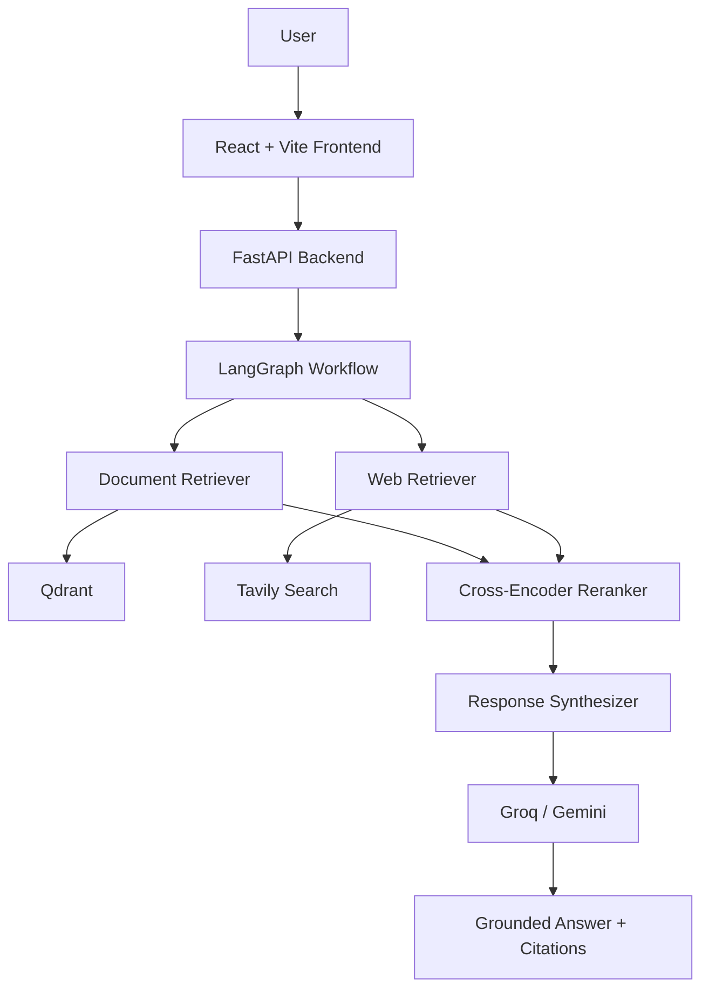
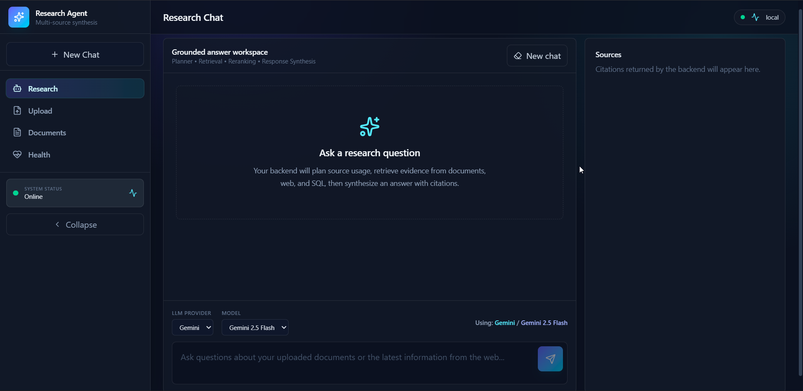
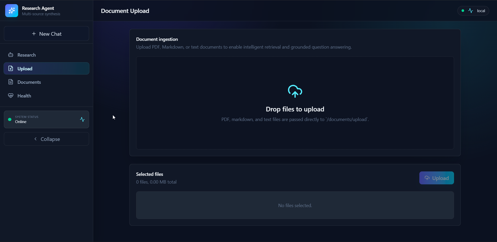
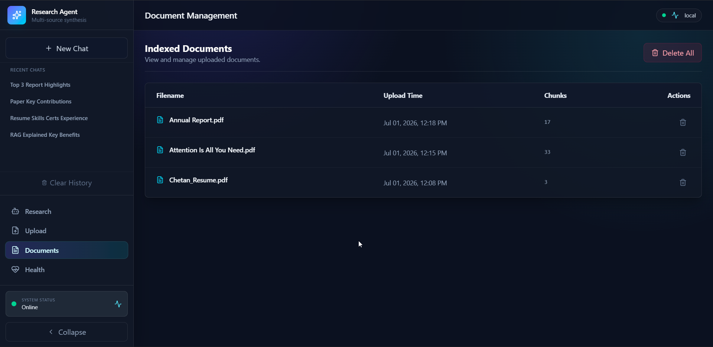
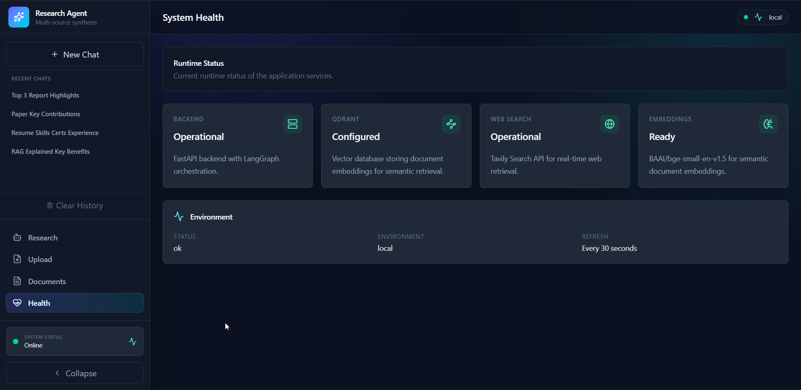
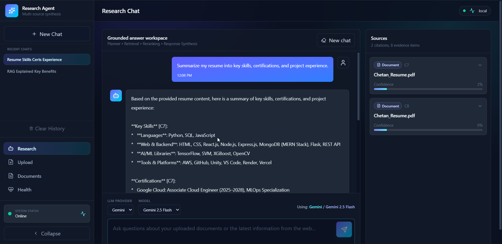
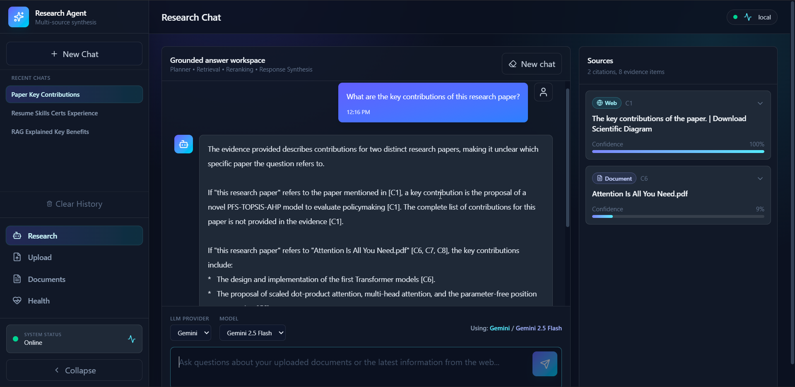
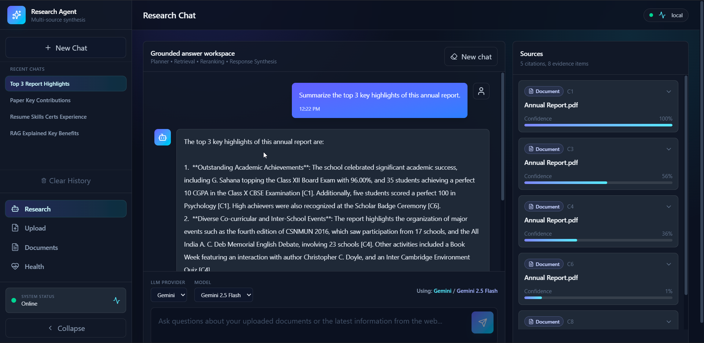
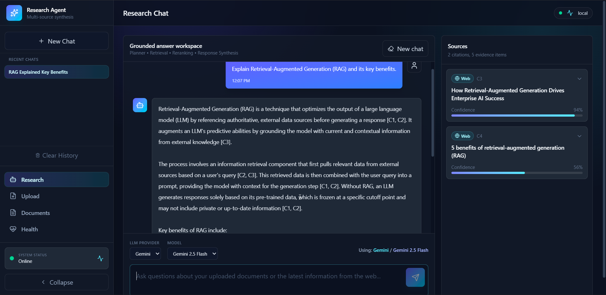

# 🔍 Multi-Source Research Agent

> **An Agentic AI Research Assistant for Grounded Knowledge Retrieval**

<p align="center">
  <strong>
    Retrieve knowledge from uploaded documents and the live web using an intelligent LangGraph workflow.
  </strong>
  <br>
  Generate grounded answers with citations and supporting evidence.
</p>

<p align="center">


</p>

------------------------------------------------------------------------

## 📖 Overview

**Multi-Source Research Agent** is an agentic AI application that
combines **document retrieval**, **live web search**, and **multiple LLM
providers** into a single research workflow.

Unlike traditional chatbots that rely only on model knowledge, this
system retrieves relevant information from uploaded documents and the
web, reranks the retrieved evidence using a cross-encoder model, and
synthesizes grounded responses with citations.

The workflow is orchestrated with **LangGraph**, enabling modular
reasoning and easy extensibility.

------------------------------------------------------------------------

## ✨ Features

| Feature | Status |
|---------|:------:|
| PDF & TXT Upload | ✅ |
| Semantic Search | ✅ |
| Qdrant Vector Database | ✅ |
| Live Web Search (Tavily) | ✅ |
| LangGraph Orchestration | ✅ |
| Cross-Encoder Reranking | ✅ |
| Multi-LLM Support (Groq & Gemini) | ✅ |
| Citations & Evidence | ✅ |
| Conversation History | ✅ |
| Document Management | ✅ |
| Health Dashboard | ✅ |

------------------------------------------------------------------------

## 🏗️ Architecture



------------------------------------------------------------------------

## 🔄 LangGraph Workflow

``` text
User Query
    │
 Planner
    │
 Router
 ┌──┴─────────┐
 │            │
Document   Web Search
Retriever  Retriever
 │            │
 └─────┬──────┘
       │
 Evidence Merge
       │
Cross-Encoder Reranker
       │
 Response Synthesizer
       │
Final Answer + Citations
```

------------------------------------------------------------------------

## 🛠️ Tech Stack

### Frontend

-   React
-   TypeScript
-   Vite

### Backend

-   FastAPI
-   LangGraph

### AI

-   Groq
-   Gemini
-   BAAI/bge-small-en-v1.5 Embeddings
-   Cross-Encoder Reranker

### Retrieval

-   Qdrant
-   Tavily Search

### Storage

-   SQLite

### Deployment

-   Docker

------------------------------------------------------------------------

## 📂 Project Structure

``` text
backend/
 ├── app/
 │   ├── api/
 │   ├── graph/
 │   ├── services/
 │   └── models/

frontend/
 ├── src/
 │   ├── components/
 │   ├── hooks/
 │   ├── pages/
 │   └── services/

docs/
infra/
docker-compose.yml
README.md
```

------------------------------------------------------------------------

## 🚀 Installation

``` bash
git clone https://github.com/ChetanVK10/Multi-Source-Research-Agent.git
cd Multi-Source-Research-Agent
```

### Backend

``` bash
python -m venv .venv

# Windows
.venv\Scripts\activate

pip install -r requirements.txt
```

### Frontend

``` bash
cd frontend
npm install
```

### Start Qdrant

``` bash
docker compose up -d qdrant
```

------------------------------------------------------------------------

## 🔑 Environment Variables

Create a `.env` file:

``` env
GROQ_API_KEY=
GOOGLE_API_KEY=
TAVILY_API_KEY=

QDRANT_URL=http://localhost:6333
QDRANT_API_KEY=

DEFAULT_PROVIDER=groq
FALLBACK_PROVIDER=gemini
```

------------------------------------------------------------------------

## ▶️ Run the Project

``` bash
# Backend
uvicorn app.main:app --reload

# Frontend
npm run dev
```

------------------------------------------------------------------------

## 💬 Example Queries

-   Summarize this uploaded research paper.
-   Compare the uploaded documents.
-   Explain Retrieval-Augmented Generation.
-   Search the web for the latest AI developments.
-   List the certifications mentioned in my resume.

------------------------------------------------------------------------

## 🌐 API Endpoints

| Method | Endpoint | Description |
|--------|----------|-------------|
| POST | `/chat` | Submit research query |
| POST | `/documents/upload` | Upload documents |
| GET | `/documents` | List uploaded documents |
| DELETE | `/documents/{id}` | Delete a document |
| GET | `/health` | Backend health status |
| GET | `/models` | Available LLM providers |


## 📸 Screenshots

<table>
  <tr>
    <td align="center"><b>Research Workspace</b></td>
    <td align="center"><b>Document Upload</b></td>
  </tr>
  <tr>
    <td></td>
    <td></td>
  </tr>

  <tr>
    <td align="center"><b>Document Management</b></td>
    <td align="center"><b>System Health</b></td>
  </tr>
  <tr>
    <td></td>
    <td></td>
  </tr>

  <tr>
    <td align="center"><b>Resume Analysis</b></td>
    <td align="center"><b>Research Paper Analysis</b></td>
  </tr>
  <tr>
    <td></td>
    <td></td>
  </tr>

  <tr>
    <td align="center"><b>Annual Report Analysis</b></td>
    <td align="center"><b>Live Web Search</b></td>
  </tr>
  <tr>
    <td></td>
    <td></td>
  </tr>
</table>

------------------------------------------------------------------------

## 📄 License

This project is licensed under the **MIT License**.

------------------------------------------------------------------------

## 👨‍💻 Author

**Chetan VK**

B.Tech -- Artificial Intelligence & Data Science

If you found this project useful, consider giving it a ⭐ on GitHub.
